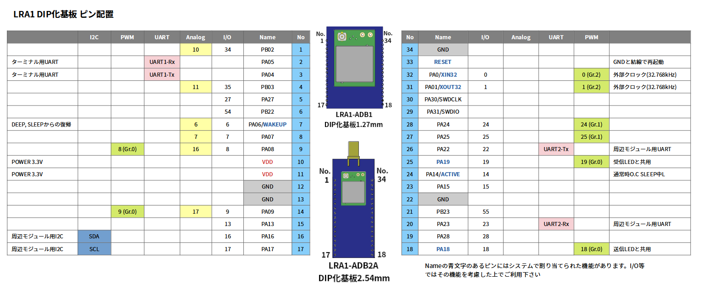
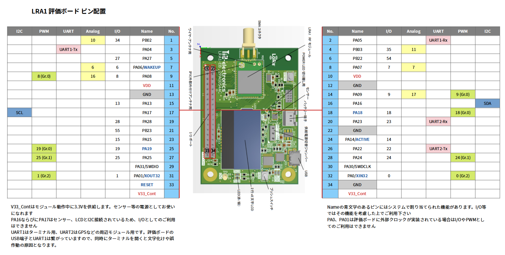

# LRA1ドキュメント

このリポジトリは、 [株式会社アイ・ツー](https://www.i2-ele.co.jp/) のLoRaモジュール [LRA1](https://www.i2-ele.co.jp/LoRa.html) の非公式ドキュメントです。個人的にまとめた物ですので、本ドキュメントで何かお気づきの点は [issue](https://github.com/TenFourth/LRA1-easy-documents/issues) または [Pull Request](https://github.com/TenFourth/LRA1-easy-documents/pulls) で対応することとし、株式会社アイ・ツーへの問合せはお止め頂きますようお願いいたします。

## 公式ドキュメント

* [LRA1 ハードウェアマニュアル](https://www.i2-ele.co.jp/LRA1_hardware.html)
  * モジュールのデータシートです。実装方法、電波の性能など仕様について詳細に書かれています
* [LRA1 ソフトウェアリファレンスマニュアル](https://www.i2-ele.co.jp/LRA1_software.html)
  * コマンドの説明が書かれています (LoRaWANに関するコマンドは除く)
* [LRA1 ソフトウェアLoRaWAN拡張リファレンスマニュアル](https://www.i2-ele.co.jp/LRA1_software_WAN.html)
  * LoRaWANに関するコマンドの説明が書かれています
* [LRA1_LoRa-WAN_GateWay設定例](https://www.i2-ele.co.jp/LRA1_LoRa-WAN_GateWay%E8%A8%AD%E5%AE%9A%E4%BE%8B_v101.pdf)
* [LRA1 UART/BASICプログラムチュートリアル](https://www.i2-ele.co.jp/LRA1_UART_BASIC.html)
  * BASICプログラムの書き方、サンプルコードが書かれています

## ピン配置

* Nameは公式ドキュメント内で書かれたピンの名称です
* `I/O` 、 `Analog` 、 `PWM` の数値は、ピンを制御する各コマンドに指定するピン番号です
  * `I/O` : `INP (Low/High入力)` 、 `OUTP (出力)` コマンド
  * `Analog` : `ADC (アナログ入力)` コマンド
  * `PWM` : `PWM` コマンド

### DIP化基板

### 評価ボード

